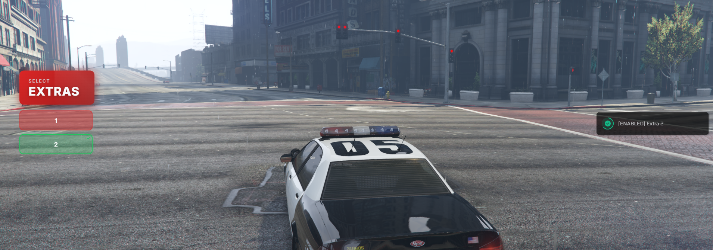
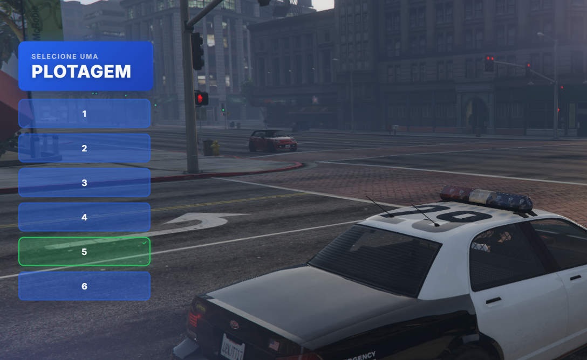

# 🚗 mri_extras - Vehicle Extras and Liveries

[](https://fivem.net/)
[](https://github.com)
[](https://github.com)
[](https://github.com)

> Optimized standalone script for vehicle customization (extras and liveries) with modern and responsive interface.

---

## 📋 Table of Contents

- [Features](#-features)
- [Previews](#-previews)
- [Installation](#-installation)
- [Configuration](#-configuration)
- [Localization](#-localization)
- [Usage](#-usage)
- [File Structure](#-file-structure)
- [Support](#-support)

---

## 📸 Previews




---

## ✨ Features

- ✅ **Standalone & Flexible** - Works without dependencies, but supports **QBCore**, **ox_lib** and **vRP**.
- ✅ **Modern Interface** - Clean Glassmorphism design, with smooth animations and real-time updates.
- ✅ **Visual Feedback** - Indicators (green borders and ✓ icons) show exactly what is active.
- ✅ **Centralized Configuration** - Everything in `config.lua`.
- ✅ **Locales System** - Easy translations via JSON files (`en`, `pt-br`, etc.).
- ✅ **Adaptable Notifications** - Smart system that detects your framework (ox_lib, qbcore, etc.).
- ✅ **Secure** - Validation to allow only drivers (configurable).

---

## 📥 Installation

1. **Download the script** and place it in the `resources` folder of your server.

2. **Add to `server.cfg`:**
   ```cfg
   ensure mri_extras
   ```

3. **Start the server** or use `refresh` followed by `start mri_extras`.

---

## ⚙️ Configuration

Edit the **`config.lua`** file:

### 1. Commands
```lua
Config.Commands = {
    Extras = "extras",        -- /extras command
    Plotagem = "plotagem"     -- /plotagem command
}
```

### 2. Notifications and Framework
Choose the notification system compatible with your server:

```lua
-- Options: "qbcore", "oxlib", "vrp", "standalone", "custom"
Config.NotifyType = "oxlib"
```

### 3. Language
The script detects the ox_lib locale or uses the default set:
```lua
Config.Locale = GetConvar("ox:locale", "pt-br")
```

---

## 🌍 Localization

The translation system is in the `locales/` folder.

- **pt-br.json** (Brazilian Portuguese)
- **en.json** (English)

To create a new language, simply copy an existing file, rename it (e.g., `es.json`) and change `Config.Locale` to `es`.

---

## 🎮 Usage

### Commands
| Command | Description |
|---------|-----------|
| `/extras` | Vehicle extras menu |
| `/plotagem` | Liveries (paint jobs) menu |

### How it Works
1. Enter a vehicle.
2. Use the command.
3. Click the buttons to toggle on/off.
   - **Green with ✓**: Active
   - **Gray**: Inactive
4. Press **ESC** to close.

---

## 📁 File Structure

```
mri_extras/
├── web/                   # NUI Interface (HTML/CSS/JS)
├── locales/               # Translation files (JSON)
├── client.lua             # Client logic
├── config.lua             # General configuration
└── fxmanifest.lua         # Manifest
```

---

## 🛠️ Support

- **Community:** [MRI QBOX](https://discord.gg/uEfGD4mmVh)
- **Author:** Murai Dev
- **Discord:** `.mur4i`
- **Version:** 2.0

---

## 📝 Changelog

### v2.0 (Complete Refactor)
- ✨ **Interface**: New modern design, active visual indicators, real-time feedback.
- ✨ **Locales**: JSON translation system implemented.
- ✨ **Notifications**: Native support for QBCore, ox_lib and vRP.
- ✨ **Code**: Complete refactoring, optimization and debug cleanup.
- ✨ **Structure**: Organization into `web` and `locales` folders.

---

**Customize your vehicles with style! 🚗💨**
